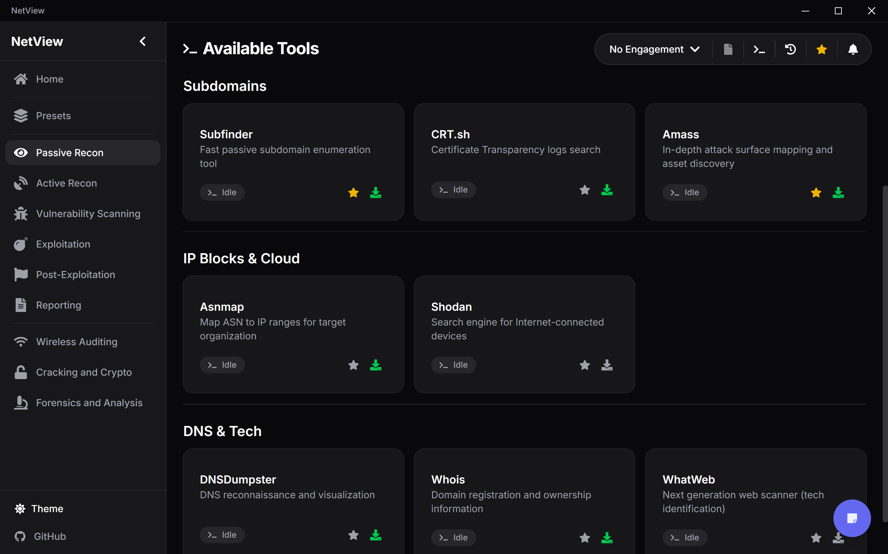
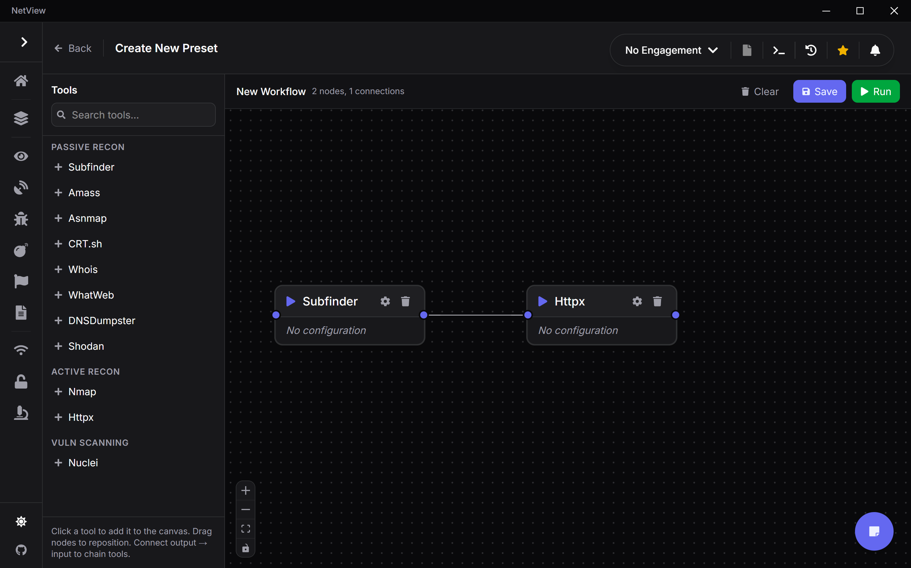
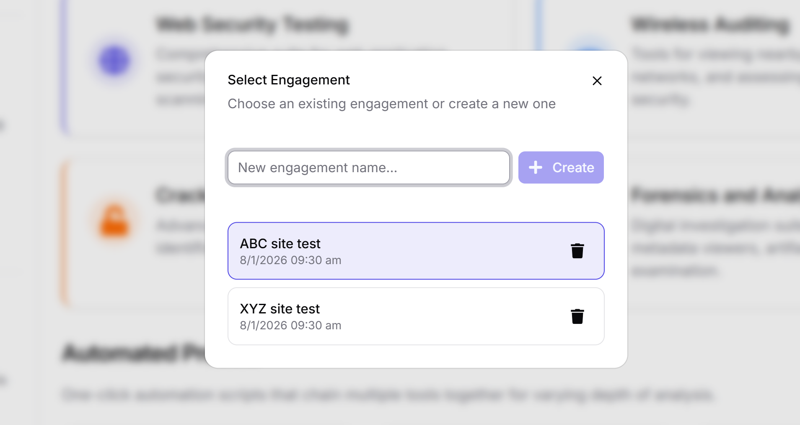

# NetView

NetView is a desktop app that provides a unified platform for running security assessment tools. Create custom presets, organize engagements, and stop juggling a dozen terminal windows - everything lives in one place.


<div align="center">
  <table>
    <tr>
      <td width="50%">
        <b>Home Dashboard</b>
        
        <br>
      </td>
      <td width="50%">
        <b>Modules</b>
         
        <br>
      </td>
    </tr>
    <tr>
      <td width="50%">
        <b>Preset creation</b>
        
        <br>
      </td>
      <td width="50%">
        <b>Engagement Management</b>
        
        <br>
      </td>
    </tr>
  </table>
</div>

## Installation and Usage

### Prerequisites

**To run the app:**

- Windows 10/11 with WSL 2 installed

**To build from source:**

- Node.js 18+
- Rust toolchain

### Download release

Download the latest `.exe` from the [Releases](https://github.com/sudeepchalla/NetView/releases) tab and run the file.

### Build from Source

```bash
git clone https://github.com/sudeepchalla/NetView.git
cd NetView
npm install
npm run tauri build
```

The compiled `.exe` will be in `src-tauri/target/release/`.

### Usage

- **Create an Engagement** - Click the engagement dropdown in the top-right and give your engagement a name
- **Pick a Module** - Choose from Passive Recon, Active Recon, Vuln Scanning, etc.
- **Configure & Run** - Select a tool, set your target, and hit run
- **View Results** - Output streams in real-time; files are saved and tracked per engagement
- **Use Presets** - Save your favorite tool combinations as one-click presets
- **And much more...**

## What is this?

NetView gives you a single, clean interface to run all your favorite security tools. No more switching between terminals. No more losing track of which scan finished. Just point-and-click simplicity with all the power underneath.

It runs on **Windows** (using WSL for the Linux tools) and is built with Tauri + React - so it's fast, lightweight, and actually looks good (Linux soon).

## Features

**🔍 Security Modules**

- Passive & Active Recon
- Vulnerability Scanning
- Exploitation & Post-Exploitation
- Wireless Auditing
- Password Cracking & Crypto Analysis
- Digital Forensics
- Would love some feedback on what more to add or change

**💡 Quality of Life**

- Engagement management - organize your pentests
- Floating toolbar with favorites, history, and notifications
- Quick notes for jotting down findings
- Dark/light themes
- All your output files tracked in one place

## Getting Started

You'll need:

- Node.js 18+
- Rust (for Tauri)
- WSL 2 on Windows

```bash
git clone https://github.com/sudeepchalla/NetView.git
cd NetView
npm install
npm run tauri dev
```

That's it. You're in.

## Project Structure

```
NetView/
├── src/                # React frontend
│   ├── components/     # UI components
│   ├── pages/          # Route pages
│   ├── stores/         # Zustand state
│   └── tools/          # Tool execution logic
├── src-tauri/          # Tauri/Rust backend
└── public/             # Static assets
```

## Tech Under the Hood

- **Tauri v2** - Fast, secure desktop runtime
- **React 19** + TypeScript
- **Tailwind CSS v4** + shadcn/ui
- **Zustand** for state
- **SQLite** for local storage

## ⚠️ Heads Up

This is for authorized security testing only. Don't be that person. Always get permission before testing systems you don't own.

## Contributing

Found a bug? Have an idea? PRs are welcome!
